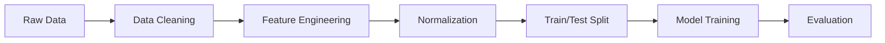

# House Price Regression - Tehran

A regression project for predicting Tehran apartment prices using machine learning.

## Dataset

~3,500 real apartment listings from Tehran. Available on [Kaggle](https://www.kaggle.com/datasets/mokar2001/house-price-tehran-iran).

### Features
| Feature | Type | Description |
|---------|------|-------------|
| Area | int | House size (m²) |
| Room | int | Number of bedrooms |
| Parking | bool | Has parking |
| Warehouse | bool | Has warehouse |
| Elevator | bool | Has elevator |
| Address | str | Location in Tehran |

### Target
- Price (Tomans)
- Price (USD)

## Pipeline

## Data Preprocessing

1. **Address Ranking** - Convert categorical addresses to numerical ranks based on median prices
2. **Remove invalid entries** - Filter out incorrect area values and missing addresses
3. **Outlier removal** - IQR method on Area feature
4. **Normalization** - Z-score standardization

## Models Tested

| Model | Features | R² Score |
|-------|----------|----------|
| Linear Regression | Area | ~0.65 |
| Linear Regression | Area, Rank | ~0.75 |
| Polynomial Regression (deg=2) | Area, Rank | **~0.80** |

## Requirements

pandas
numpy
matplotlib
scikit-learn

## Usage

bash
pip install pandas numpy matplotlib scikit-learn
jupyter notebook project.ipynb

## Results

Best model achieved **~80% accuracy** using polynomial regression on **Area** and **Rank** features.

> More advanced solutions available on [Kaggle](https://www.kaggle.com/datasets/mokar2001/house-price-tehran-iran/code)

## License

MIT

